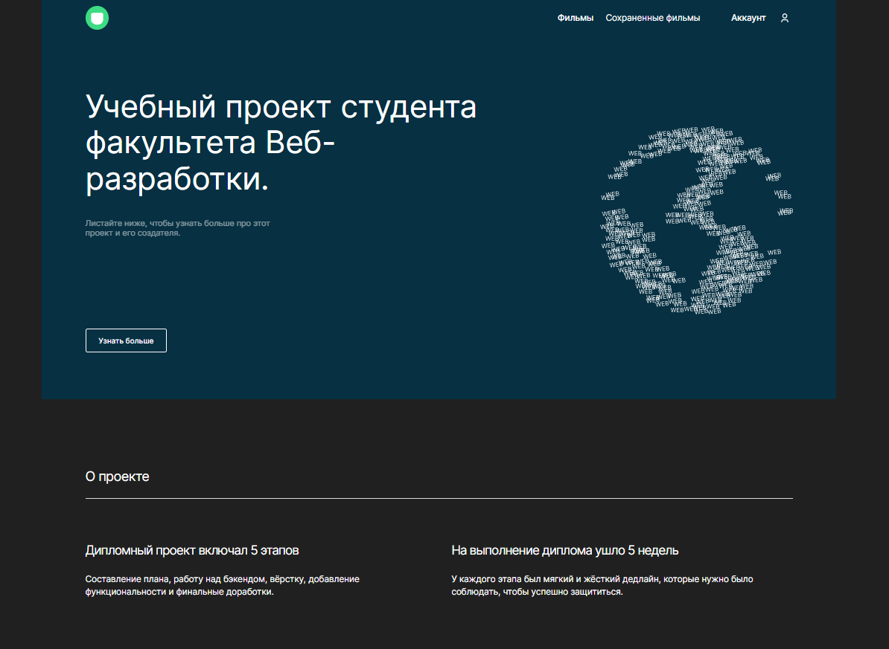
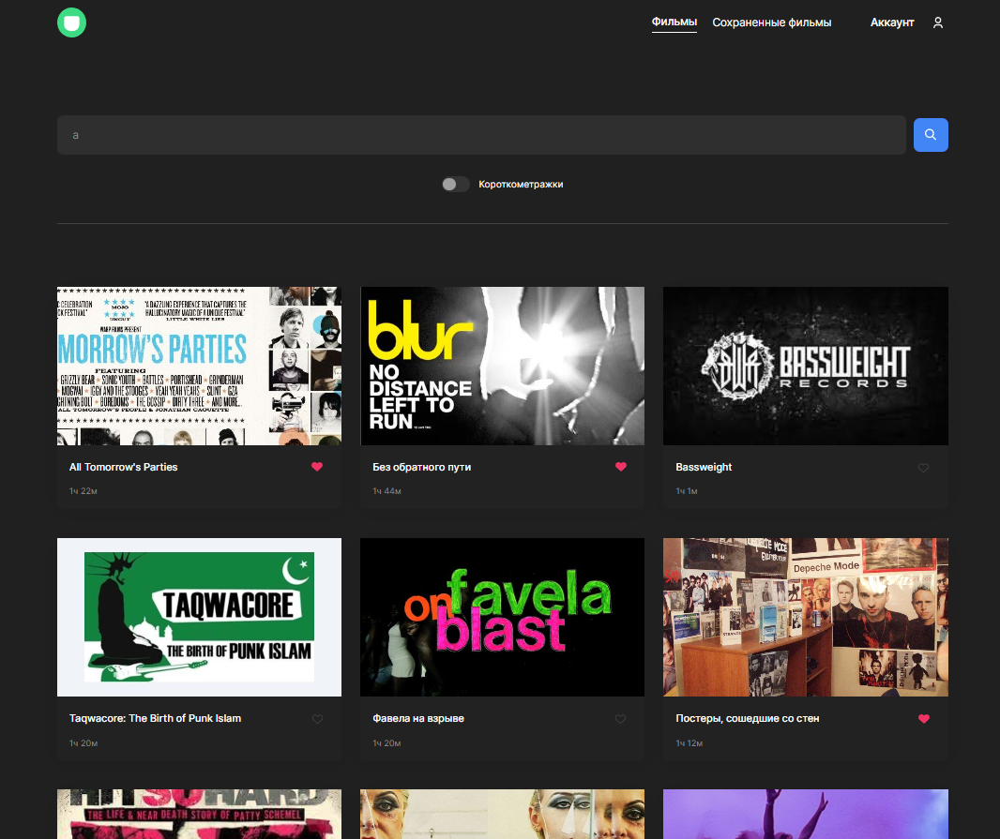

# Дипломный проект (frontend)

## Описание

Дипломный проект, фронтенд часть которой выполнена на основе обучения в  [Яндекс.Практикуме](https://praktikum.yandex.ru/)
по специальности Веб-разработчик. Серверная часть подготовлена и  находится в репозитории
[movies-explorer-api](https://github.com/Gasay-Liza/movies-explorer-api)

В проекте было реализовано:
* настроена инфраструктура и создан сервер на express;
* подключена база данных, созданы схемы и модели ресурсов API;
* реализовано логирование, аутентификация и авторизация на сервере;
* бэкенд задеплоен на Яндекс Облако;
* свёрстаны компоненты на React, разметка портирована в его формат;
* страницs регистрации, логина, редактирования профиля, сохранённых фильмов;
* реализованы асинхронные GET- и POST-запросы к API;
* проработаны авторизованные и неавторизованные состояния, сохранение фильмов в профиле;
* полученные фильмы фильтруются на стороне клиента.

## Страница проекта

https://github.com/Gasay-Liza/movies-explorer-api

## Ссылки на проект
Backend https://api.gasay-movies-explorer.nomoredomains.rocks

Frontend and backend https://gasay-movies-explorer.nomoredomains.xyz/

Pull request https://github.com/Gasay-Liza/movies-explorer-frontend/pull/2

### Screenshot

## Структура и функционал

Сайт состоит из нескольких страниц:

*  `/` — **главная страница**. Содержит информацию о выполненном проекте.
*  `/movies` — **страница с фильмами**. На ней есть форма поиска фильмов и блок с результатами поиска.
*  `/saved-movies` — **страница с сохранёнными фильмами.** Показывает фильмы, сохранённые пользователем.
*  `/signup` — **страница регистрации.** Позволяет пользователю зарегистрировать аккаунт.
*  `/signin` — **страница авторизации.** На ней пользователь может войти в систему.
*  `/profile` — **страница редактирования профиля.** Пользователь может изменить данные своего аккаунта.

## Технологии

Проект реализован на React, структура проекта создана с помощью `Create React App`

## Инструменты и стек: 
- HTML
- CSS
- JS
- Express
- MongoDB
- React
- Express 
- MongoDB 
- NodeJS 
- API
- Nginx 
- JWT 
- Postman

## Ссылка на сгенерированный макет в Figma

[Макет](https://www.figma.com/file/r0yOl9EKdJgLnATzGxYzXQ/Diploma-(Copy)?type=design&node-id=891%3A3857&t=Q5WhxzxHVRj2cOhH-1)

## Запуск проекта

1. Клонировать репозиторий

    `git clone https://github.com/Gasay-Liza/movies-explorer-api.git`

2. Установить зависимости

    `cd movies-explorer-frontend`

    `npm install`

3. Для запуска использовать команды

    `npm start`

    Запуск приложения в режиме разработки.
    Для просмотра результатов в браузере откройте http://localhost:3000
    После внесения изменений страница перезагрузится автоматически

    `npm run build`

    Создает оптимизированную версию приложения, готовую для развертывания, в папке `build`

## Автор

**Гасай Елизавета**

- e-mail: [gasayliza@gmail.com](mailto:gasayliza@gmail.com)
- Telegram: [@gasayliza](https://t.me/gasayliza)
